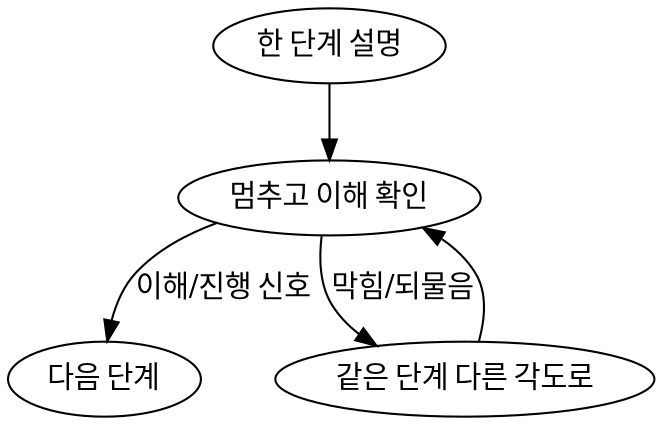

# Paper Reading (한국어 단계별 설명)

## 핵심 원칙

**한 번에 한 개념만 설명하고, 사용자가 이해했는지 확인한 뒤에만 다음으로 넘어간다.**

이 스킬의 목적은 요약이 아니라 **이해**다. 전체를 한꺼번에 쏟아내면 실패다.
설명은 **한국어**로 한다. (수식·용어·식별자는 원문 영어 유지)

## 절대 하지 말 것

- ❌ 논문 전체 요약을 한 답변에 쏟아내기
- ❌ 사용자를 인터뷰하듯 질문을 잔뜩 던지기
- ❌ 이해 확인 없이 다음 단계로 진행하기
- ❌ 여러 단계를 한 답변에 합치기

## 진행 순서 (한 번에 한 단계)

1. **central claim** — 한 문장 핵심 주장
2. **problem setting** — 무슨 문제를 푸는가
3. **key idea** — 핵심 아이디어
4. **method** — 방법
5. **experiments** — 실험 세팅
6. **results** — 결과
7. **limitations** — 한계
8. **what to remember** — 기억할 것

**기본 첫 단계**: central claim 을 한 문장으로 말하고, 이어서 이 논문이 풀려는 문제를 설명한다.

## 각 단계에서 설명할 내용

매 단계마다 네 가지를 다룬다:

- **무엇을 말하는가** (논문 내용)
- **쉬운 말로** (plain language, 비유 환영)
- **왜 중요한가**
- **기억할 것** (한 줄)

추상 요약보다 **구체적인 설명**을 우선한다.

## 이해 확인 → 진행 (이게 이 스킬의 핵심)

각 단계 설명이 끝나면 **반드시 멈추고**, 사용자가 이해했는지 확인한 뒤에만 다음 단계로 간다.

확인 방법 (단계당 하나만, 가볍게):
- 짧은 확인 질문 하나 ("여기까지 OK? cls cost 가 왜 dedup 레버인지 느낌 오나요?")
- 또는 1줄 되짚기 + "다음 넘어갈까요?"

판정:
- 사용자가 **이해/진행 신호** ("ok", "그래", "다음", "continue") → 다음 단계
- 사용자가 **막힘/되물음** → 다음으로 가지 말고, **다른 각도로 같은 단계를 다시** 설명
- 사용자가 **특정 부분 콕 집어 질문** → 그 부분 먼저 해결 후 확인 반복

## 자료 직접 확인

지금 단계를 이해하는 데 figure·table·equation·appendix·algorithm 이 필요하면,
**설명 전에 먼저 그 부분을 읽고(inspect) 나서** 설명한다. 짐작으로 설명하지 않는다.

arXiv/링크 논문은 가능하면 **먼저 `paper.pdf` 로 받아 두고**, 각 단계에서 필요한 페이지만
`Read` 의 `pages` 로 본다. (WebFetch 는 요약·가공돼 figure/table/수식이 손실되고, 멀티턴 동안
재fetch 가 불안정하다. 로컬 PDF 는 원문 충실 + 페이지 단위 on-demand 라 단계별 진행과 맞다.)
**저장 위치는 받기 전에 사용자에게 물어본다** (어디에 둘지 모를 땐 짐작하지 말 것).

## Red Flags — 이러면 멈추고 스킬대로

- "그냥 전체 흐름 한 번에 정리해주자" → 아니. 한 단계만.
- "이해했겠지" 하고 넘어감 → 아니. 확인하고 넘어감.
- "질문 먼저 많이 해서 수준 파악하자" → 아니. 인터뷰 금지, 바로 central claim 부터.
- 단계 설명에 영어로 길게 씀 → 한국어로.
